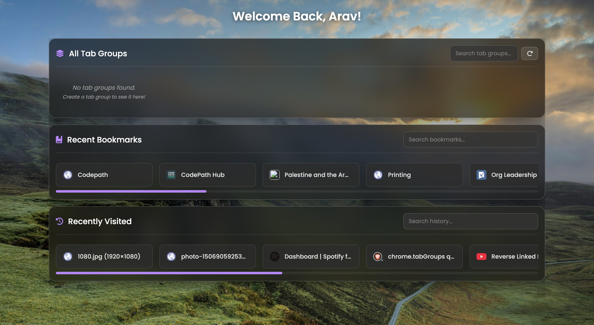

# Custom HTML Page - Browser Extension

A Chrome/Brave browser extension that provides a unified dashboard for managing tab groups, bookmarks, browsing history, and displays beautiful nature-themed background images.

## Overview

This browser extension creates a custom new tab page that consolidates essential browsing tools into a single, elegant interface. It displays your active tab groups, recent bookmarks, browsing history, and features a rotating gallery of high-quality nature images as backgrounds.

The extension is designed to enhance productivity by providing quick access to frequently used browser features while maintaining a clean, visually appealing interface.

## Features

### Current Features

- **Tab Groups Management**
  - View all active tab groups with their custom colors
  - Display group titles, window IDs, and group IDs
  - Visual indicators for collapsed groups
  - Real-time search/filter functionality
  - Manual refresh button to reload groups
  - Color-coded bars matching each group's assigned color

- **Recent Bookmarks**
  - Display 20 most recently added bookmarks
  - Favicon support for visual recognition
  - Search functionality to filter bookmarks by title or URL
  - Direct links to bookmarked pages
  - Automatic filtering of folder entries (shows only actual bookmarks)

- **Browsing History**
  - Shows 10 most recent unique domains from browsing history
  - Deduplicates entries by hostname to avoid repetition
  - Favicon display for each history item
  - Search functionality to filter by title or URL
  - Quick access to recently visited sites

- **Background Gallery**
  - Curated collection of high-quality nature images
  - Random image selection on each page load
  - Full-size background display with proper scaling
  - Images sourced from Unsplash and Pinterest

- **User Interface**
  - Clean, modern design with glassmorphism effects
  - Responsive layout that adapts to different screen sizes
  - Search bars with visual feedback (red border for no results)
  - Empty state messages for better user experience
  - Smooth animations and transitions

## APIs Used

### Chrome Extension APIs

1. **chrome.tabGroups**
   - `chrome.tabGroups.query({})` - Retrieves all tab groups across all windows
   - Used to display active tab groups with their properties (title, color, collapsed state, window ID)
   - Requires Chrome/Brave 89+ or Edge 89+

2. **chrome.bookmarks**
   - `chrome.bookmarks.getRecent(20)` - Fetches the 20 most recently added bookmarks
   - Returns bookmark objects with title, URL, and metadata
   - Automatically filters out folder entries

3. **chrome.history**
   - `chrome.history.search({ text: '', maxResults: 100 })` - Searches browsing history
   - Retrieves up to 100 recent history entries
   - Extension filters and deduplicates by hostname

4. **chrome.runtime**
   - `chrome.runtime.lastError` - Error handling for asynchronous API calls
   - Provides detailed error messages when API calls fail

### External APIs

1. **Google Favicon Service**
   - `https://www.google.com/s2/favicons?domain={url}&sz=32`
   - Fetches 32x32 pixel favicons for bookmarks and history items
   - Provides fallback icons when site-specific favicons are unavailable

2. **Image Hosting Services**
   - Unsplash - High-quality, royalty-free nature photography
   - Pinterest - Curated image collection
   - Images are loaded directly via HTTPS URLs

## Installation

1. Clone or download this repository to your local machine
2. Open your Chrome/Brave browser
3. Navigate to `chrome://extensions/` (or `brave://extensions/`)
4. Enable "Developer mode" in the top-right corner
5. Click "Load unpacked"
6. Select the project directory
7. The extension will be installed and activated
8. Open a new tab to see the custom page

## Known Issues

### Critical Issue: Inactive Tab Groups Not Retrieved

**Problem**: The extension currently cannot retrieve inactive (collapsed/memory-offloaded) tab groups in Chromium-based browsers, particularly Brave.

**Technical Details**:
- Chromium browsers implement memory offloading for inactive tab groups to improve performance
- When tab groups are collapsed or inactive for extended periods, they may be offloaded from active memory
- The `chrome.tabGroups.query({})` API only returns tab groups that are currently in active memory
- This results in incomplete data, as collapsed or inactive groups are not included in the query results

**Impact**:
- Users may see fewer tab groups than actually exist
- Collapsed groups may disappear from the extension's display
- The extension cannot provide a complete overview of all tab groups

**Attempted Solutions**:
- Previously implemented separate queries for `collapsed: true` and `collapsed: false` groups
- Created synthetic group objects as fallbacks
- Added extensive debugging and visual indicators
- These workarounds were removed in favor of a simpler implementation

**Current Status**: 
This is a limitation of the Chrome Tab Groups API and browser memory management. A complete solution would require either:
1. Browser-level changes to the Tab Groups API
2. Alternative data sources (e.g., browser storage, session management)
3. Re-implementation of the separate query workaround with proper error handling

## Future Development Plans

1. **Customization Options**
   - User-selectable background images or upload custom images
   - Theme selection (light/dark mode, color schemes)
   - Configurable number of items displayed per section
   - Toggle visibility of individual sections

2. **Make it Generalized and Distributable**
   - Implement a version that can be edited in the frontend, improving user experience
   - Generalizing functionality for multiple browsers
   - Support for other browsers (Firefox, Opera, etc.)
   - Installable through the Google Chrome Store.
## Technical Details

### Browser Compatibility

- **Minimum Version**: Chrome 89+, Brave 89+, Edge 89+
- **Reason**: Tab Groups API was introduced in Chrome 89
- **Tested On**: Brave Browser (latest), Chrome (latest)

### Performance Considerations

- Bookmarks limited to 20 most recent entries
- History limited to 100 entries, filtered to 10 unique domains
- Images are loaded on-demand with browser caching
- Search operations use client-side filtering for instant results

### Code Architecture

- **Event-driven**: Uses DOMContentLoaded for initialization
- **Modular functions**: Separate functions for each feature (tab groups, bookmarks, history, gallery)
- **Reusable rendering**: Helper functions for rendering with search functionality
- **Error handling**: Comprehensive error checking and user-friendly messages
- **No external dependencies**: Pure vanilla JavaScript, no frameworks required

## Contributing

Contributions are welcome! If you'd like to improve this extension:

1. Fork the repository
2. Create a feature branch (`git checkout -b feature/amazing-feature`)
3. Commit your changes (`git commit -m 'Add amazing feature'`)
4. Push to the branch (`git push origin feature/amazing-feature`)
5. Open a Pull Request

Please ensure your code follows the existing style and includes appropriate error handling.

## License

This project is open source and available under the MIT License.

---

**Note**: This extension is a personal project and is not affiliated with or endorsed by Google, Brave Software, or any browser vendor.

For issues, questions, or suggestions, please open an issue on the project repository.
